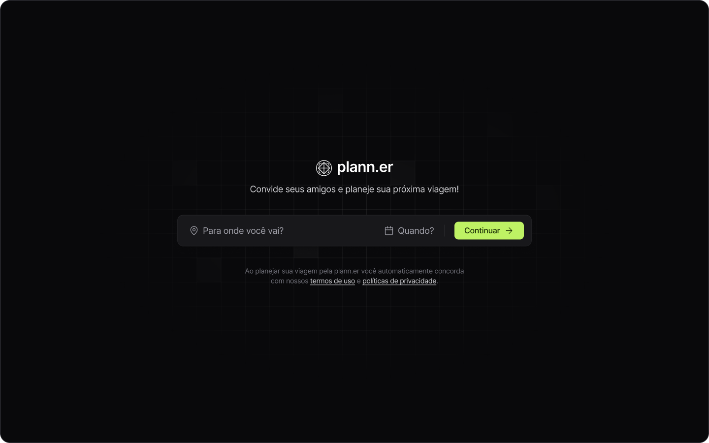
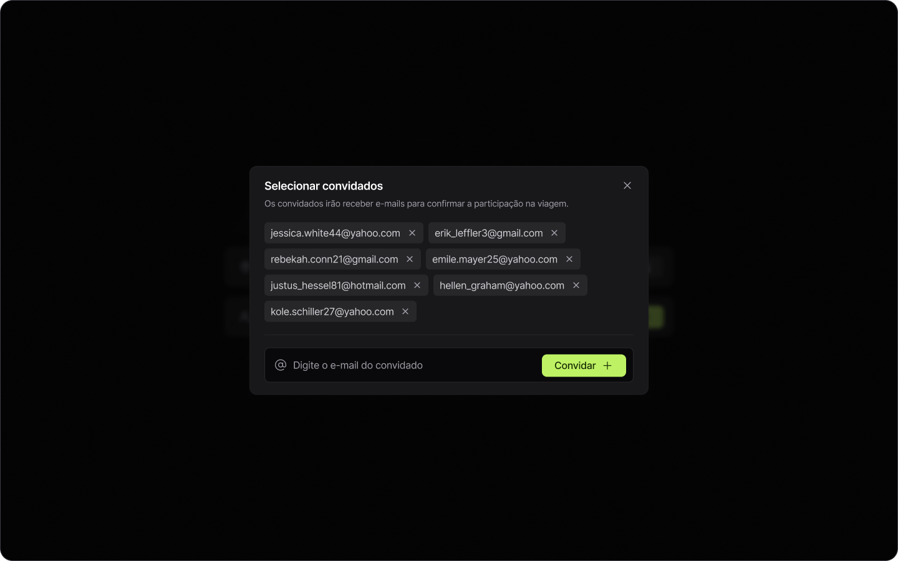
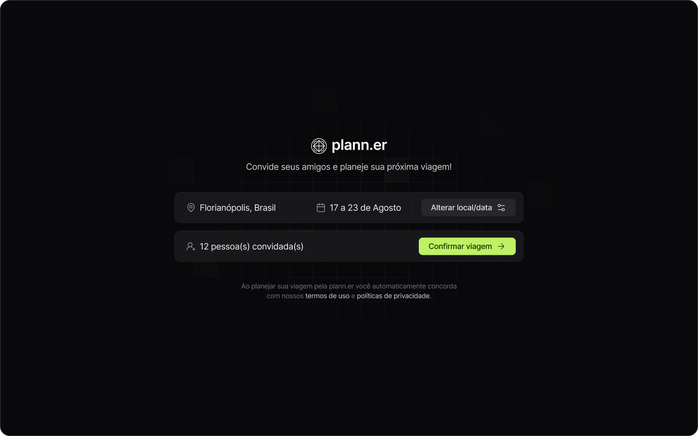
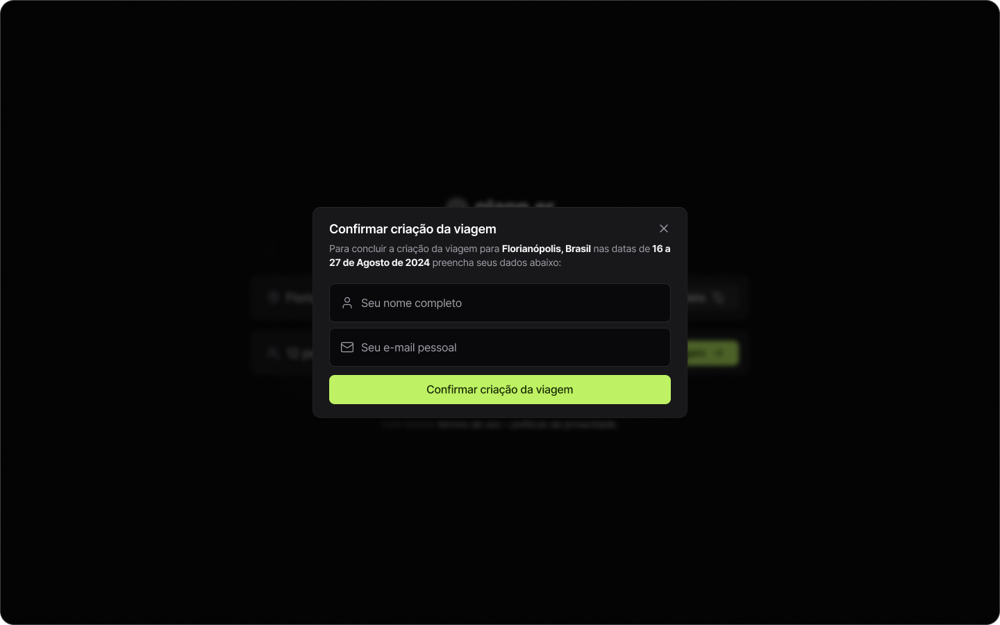
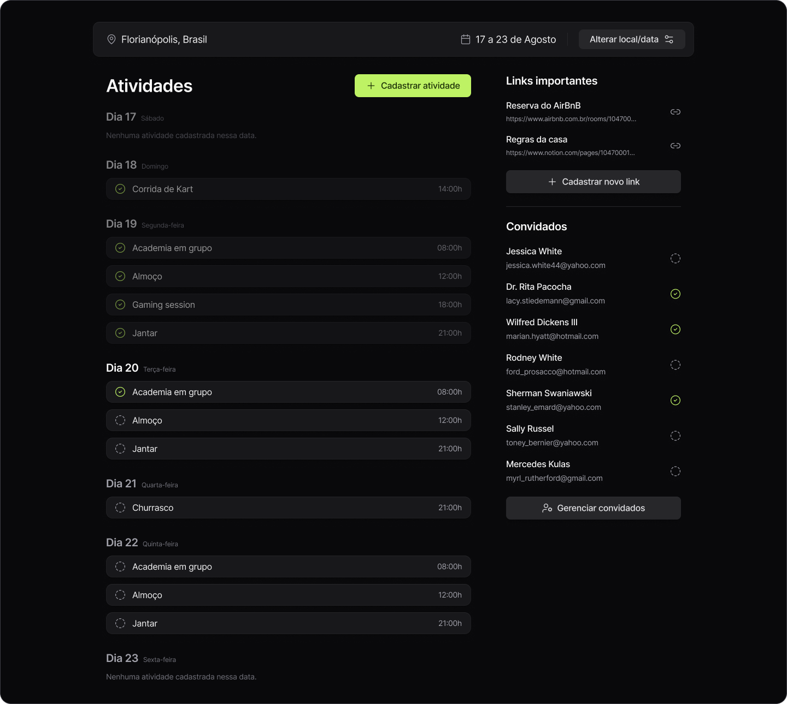
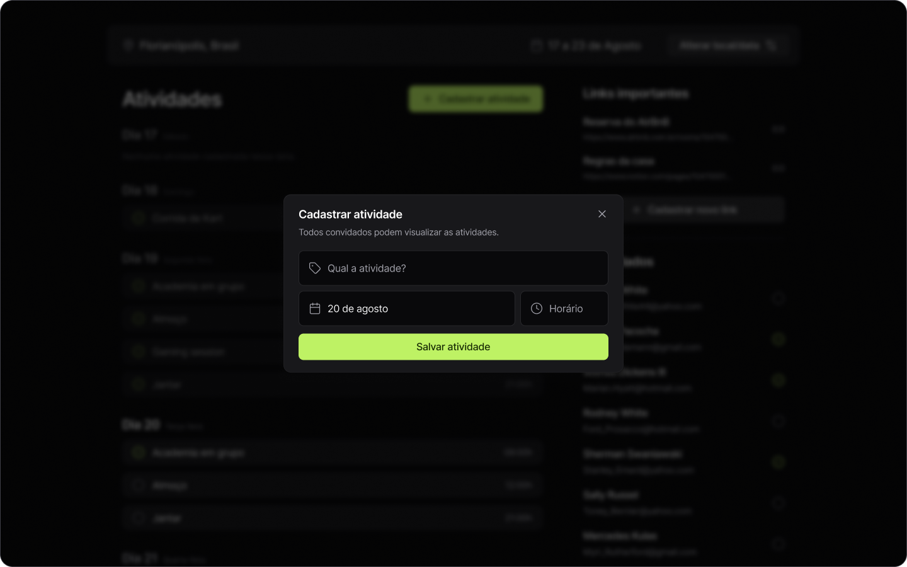
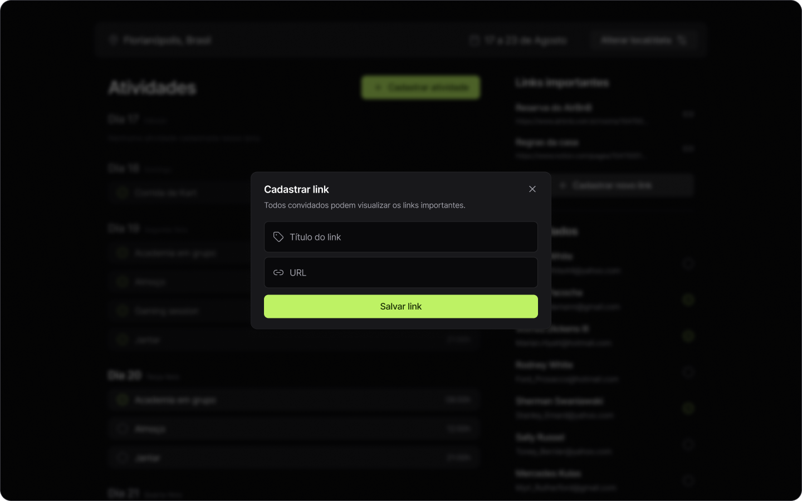

<h1 align="center">
 Plann.er
</h1>

<h4 align="center"> 
	Aplicação finalizada 
</h4>

<p align="center">
 <a href="#-deploy">Deploy</a> | 
 <a href="#-layout">Layout</a> | 
 <a href="#-setup">Setup</a> | 
 <a href="#-technologies">Technologies</a> | 
</p>

## 🔗 Deploy

O deploy da aplicação pode ser acessada através da seguinte URL base: https://planner-henna.vercel.app/

## 🎨 Layout

A seguir, veja uma demonstração das principais telas da aplicação:

<p align="center">
  
</p>

<p align="center">
  
</p>

<p align="center">
  
</p>

<p align="center">
  
</p>

<p align="center">
  
</p>

<p align="center">
  
</p>

<p align="center">
  
</p>

## ⚙ Setup

### 📝 Pre Requisites

- Para reproduzir o acesso a API back-end com os dados necessários para o front-end, clone o seguinte [repositório](https://github.com/nicolasbmorais/planner-api) que contem a API do back-end feita em Node.js disponibilizado pela `Rocketseat` execute na sua máquina.

### Cloning and Running

Passo a passo para clonar e executar a aplicação na sua máquina:

```bash
# Clone este repositório
$ git clone https://github.com/nicolasbmorais/plann.er.git

# Acesse a pasta do projeto no terminal
$ cd plann.er

# Instale as dependências
$ npm install

# Execute a API back-end

# Execute a aplicação em modo de desenvolvimento
$ npm run dev

# A aplicação inciará em alguma porta disponível que poderá ser acessada pelo navegador
```

## 🛠 Technologies

Foram usadas as seguintes ferramentas na construção do projeto:

- **[React + Vite](https://vitejs.dev/)**
- **[TypeScript](https://www.typescriptlang.org/)**
- **[TailwindCSS](https://tailwindcss.com/)**
- **[TailwindCSS Variants](https://www.tailwind-variants.org/)**
- **[React Router DOM](https://reactrouter.com/)**
- **[Lucide](https://lucide.dev/)**
- **[React Day Picker](https://daypicker.dev/)**
- **[date-fns](https://date-fns.org/)**
- **[Sonner](https://sonner.emilkowal.ski/)**
- **[Axios](https://axios-http.com/ptbr/docs/intro)**

> Confira [package.json](./package.json) para mais detalhes das dependências

<p align="center">
  Feito por Nicolas Morais 👋🏽 <a href="https://www.linkedin.com/in/nicolasb-morais/" target="_blank">Entre em contato!</a>  
</p>
